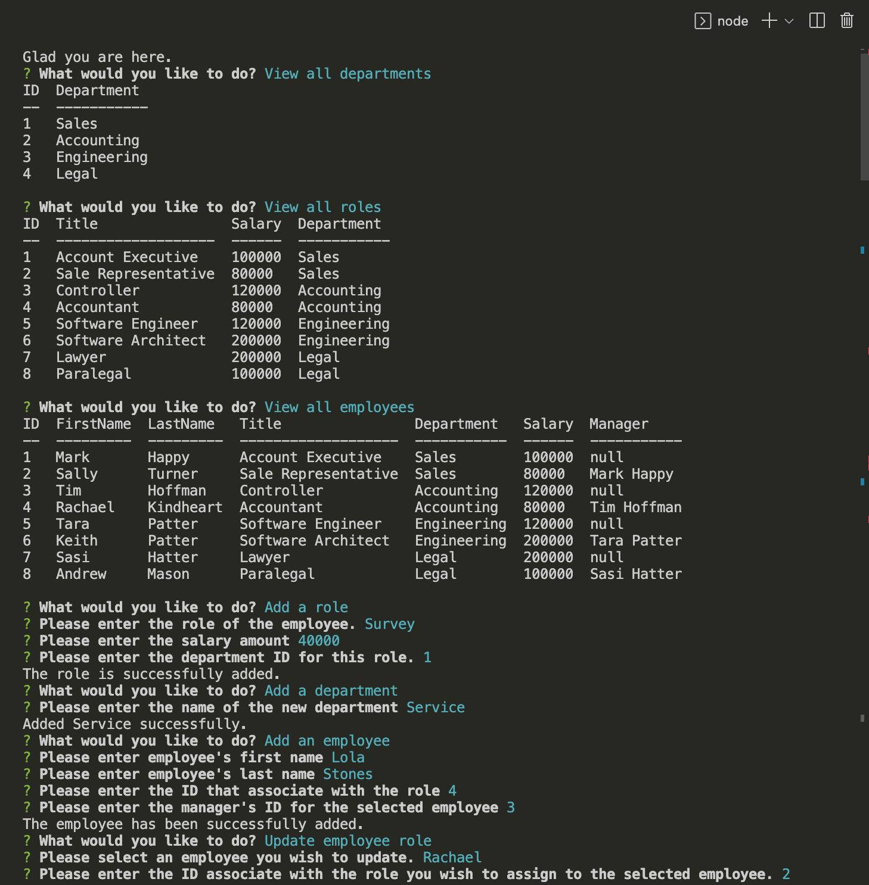

# Employee Tracker
Command-line application to manage a company's database.

## Table of Centents
1. [Descriptions](#descriptions) 
2. [Installations](#installations)
3. [Usage](#usage)
4. [Contributing](#contributing)
5. [Link](#link)

## Descriptions

The Employee Tracker application allows the users to view, add, delete and update the company's database. This interfaces are called 'content management systems (CMS). Developer uses MySQL to create and generate the database then connect the database to the system using JavaScript and execute it using node.js.

## Installations

The following installation are required to run the application.

To connect to MySQL database.
```pip
  npm install --save mysql2
```

To interact with the user via the command line.
```pip
  npm install inquirer@.2.4
```

To print MySQL rows to the console.
```pip
  npm install console.table --save
```

## Usage

There are two parts that will need to be done to start the application. 

MySQL : We need to access to the database first by doing the following.

To get into the shell.
```pip
  mysql -uroot
```

To access schema.sql (where the database structures are created).
```pip
  source schema.sql;
```

To access seeds.sql (where the database are generated to match the structures in schema.sql).
```pip
  source seed.sql;
```

Node.js : This will invoke the application after we get the database.
```pip
  node server.js
```

Once the application starts users will be presented with the list of options. Each options will prompt the users for the input and will update the input into the proper database. 

This Employee Tracker application offers the following options:
 * View all Departments, View all Employees, View all Roles.
 * Add a Department, Add a Role, Add an Employee.
 * Update Employee Role, Delete a Department and Remove an Employee from the database.



## Contributing

My instructor Mr.Anthony Cooper and Slack Learning Support Team.

## Link

You can click the following link for the walkthrough video of the Employee Tracker App.

[Walkthrough Video](https://watch.screencastify.com/v/nrYzcG7IMf2ukKEz4dOy)


